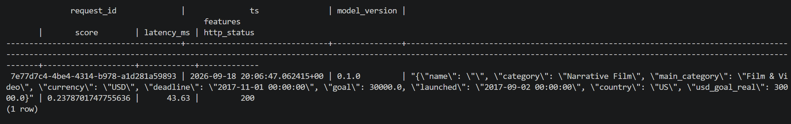
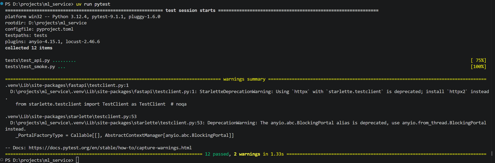
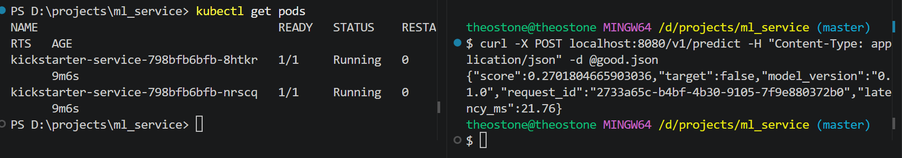
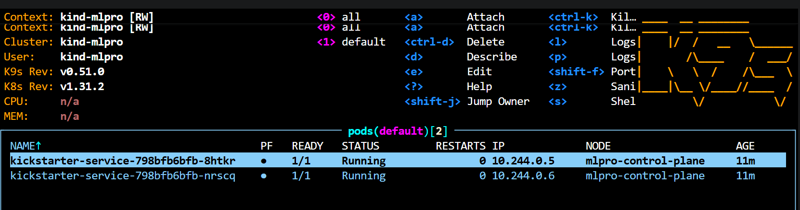

## 3 команды

uv run pytest

docker build -t kickstarter-service:1.0 .

kind load docker-image kickstarter-service:1.0 --name mlpro

## Кратко про суть

Датасет взял Kickstarter Projects, можно придумать много интересной обвязки. Например есть фича usd_goal_real - это перевод из оригинальной валюты в доллары, можно параллельно повесить апишку (обновлять где нибудь раз в час) и бд с курсами валют. Модель взял особо не заморачиваясь (логрег) - времени мало, заодно потом поиграюсь с разными версиями моделей. 

## Проблемы 

При проектировании модели работал на кагле, самописные классы препроцесса делал прямо в ноутбуке. Думал прокатит - не прокатило: joblib же не тянет сами классы, только пути. В итоге положил классы в src/kickstarter/service/transformers.py и переобучил модель уже в самом репе. Могут быть траблы uv, много раз пересобирал, могут быть траблы с путями (ноутбук надо запускать из корня)

Добавил мидлварю которая ловит статус и прокидывает в бд, код сохранения в бд перенес из predict в нее

Из честно не завелось: не завелась команда

kind create cluster --name mlpro

Запускал так

kind create cluster --name mlpro --image kindest/node:v1.31.2

Мб проблема с оперативкой, там под 98% было

## Скрины

docker compose exec db psql -U postgres -d kickstarter -c "SELECT * FROM predictions;"

Тесты

Port-forward

k9s

## Команды для себя

uv run uvicorn kickstarter.service.app:app --port 8000

uv run pytest

curl -X POST localhost:8000/v1/predict -H "Content‐Type: application/json" -d @good.json

docker build -t kickstarter-service:1.0 .
docker run --rm -p 8000:8000 kickstarter-service:1.0

docker compose up --build -d
docker compose exec db psql -U postgres -d kickstarter -c "SELECT request_id, score, latency_ms FROM predictions;"
docker compose down

kind create cluster --name mlpro
kind load docker-image kickstarter-service:1.0 --name mlpro
kubectl apply -f k8s/
kubectl rollout status deploy/kickstarter-service
kubectl port-forward svc/kickstarter-service 8080:80
