# Что делал

Корректировки после ревью: переделал импорт kickstarter/service/transformers.py при обучении

Взял за гейт ROCAUC потому что изначально на него смотрел в ноутбуке. Можно было взять и PRAUC, но дизбаланс небольшой - не критично.

В артифакты докинул PRUAC как в ноутбуке

# Отчет

# 1. Все поднял, все заработало

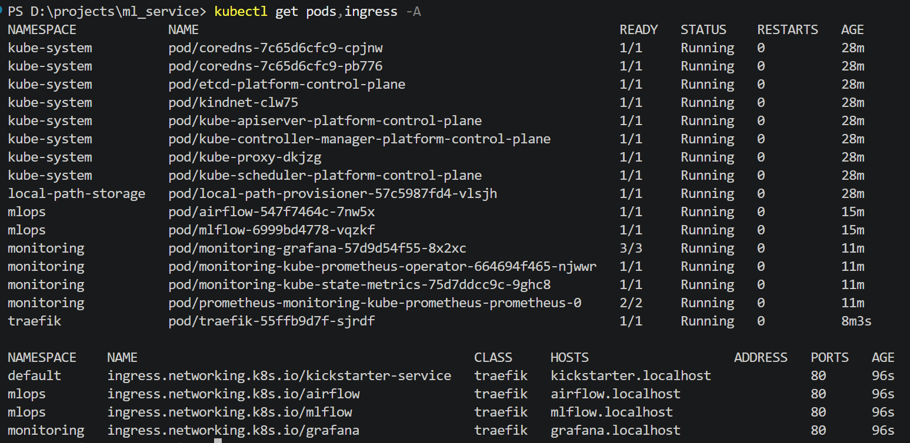

Обучил модель, один раз словил красный, описано в проблемах

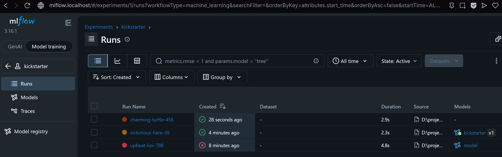

# 2. Сделал 3 запуска: в одинаковых, в 3 C=0.02.

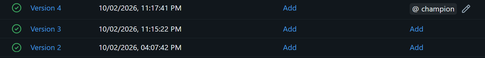

# 3. Натренировал новую модель, она получила champion, перезапустил сервис

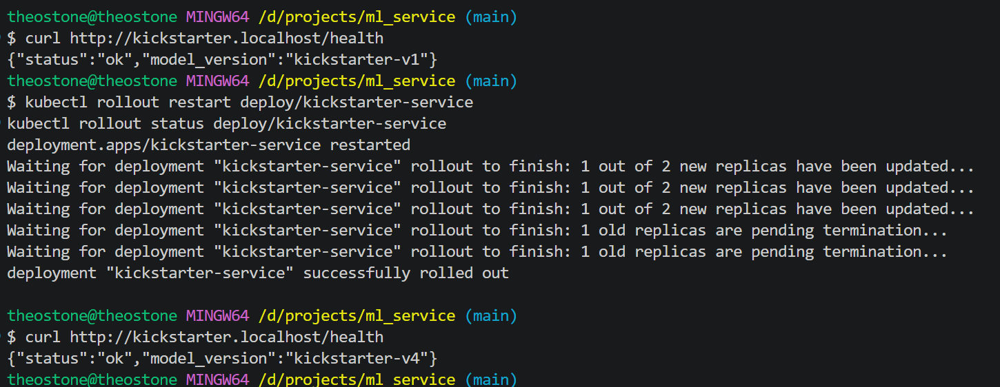

время перезапуска одного пода примерно 2 минуты

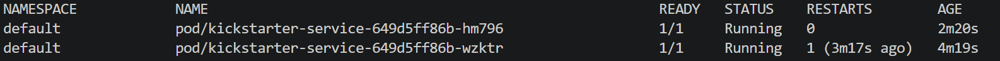

# 4. Зеленый прогон

https://github.com/Teodorus730/ml_service/actions/runs/37073296154/job/111057750127

Ранер:

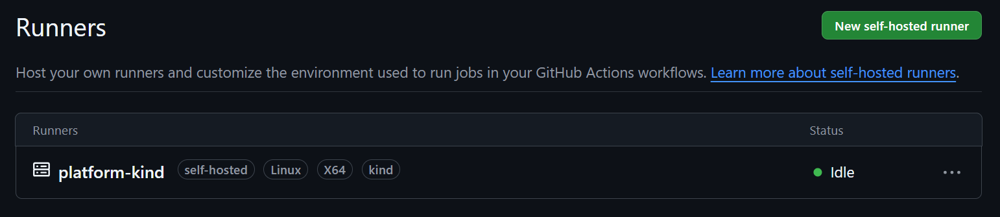

# 5. Сделал срез на 50к строк

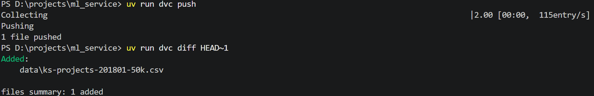

Спуллил в копии репа

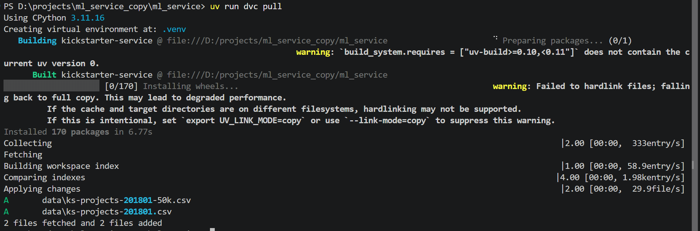

Обучил 2 модели на разных данных (пока что менял путь прямо в train.py хз как правильно)

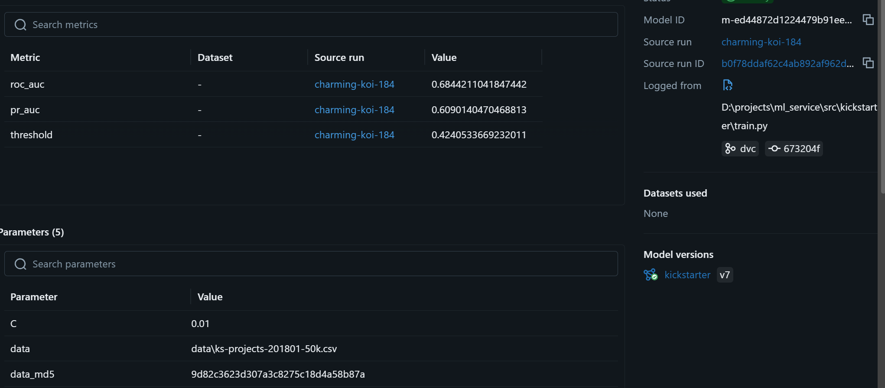

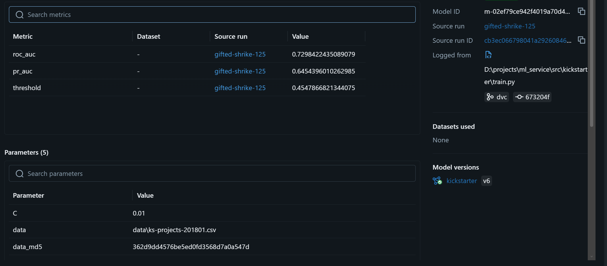

# 6. Locust

Не понял что за 3 прогона, автоскейл запустился, поды поубивались через 5 минут после конца тестирования

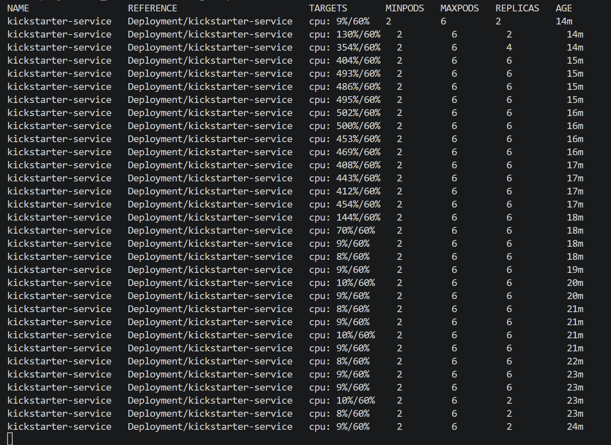

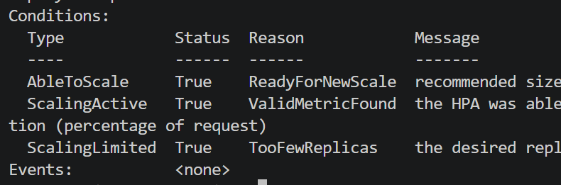

# 7. Сломать починить

## Алиас kek

упал шаг service (несколько рестартов на поде). в логе пода k9s: mlflow.exceptions.RestException: INVALID_PARAMETER_VALUE: Registered model alias kek not found. Статус CrashLoopBackOff

Красный: https://github.com/Teodorus730/ml_service/actions/runs/37190824590/job/111402712234

Зеленый: https://github.com/Teodorus730/ml_service/actions/runs/37191799132/job/111405560494

На зеленом перед прогоном поменял rollout timeout на 240с

## KIND_CLUSTER: kek

В логах ci пункт kind, cubectl ошибка ERROR: could not locate any control plane nodes for cluster named 'kek'.

Красный: https://github.com/Teodorus730/ml_service/actions/runs/37192040045/job/111406281493

Зеленый: https://github.com/Teodorus730/ml_service/actions/runs/37192287534/job/111406971918

## kek.localhost в smoke

А тут никак не найдешь: просто смоук падает и все - сам запрос кривой. Разве что в диагностику можно добавить вывод ingress, мб поможет

Красный: https://github.com/Teodorus730/ml_service/actions/runs/37192715808/job/111408282042

Зеленый: https://github.com/Teodorus730/ml_service/actions/runs/37193145965/job/111409547267

# Проблемы

Пока делал train возник вопрос: а как в бигтехах хранятся датасеты? Условно airflow запускает пайплайн по расписанию например на данных за последнюю неделю. То есть они просто с бд тянутся, без проверок и обработок?

Ну и в принципе в пайплайне данные например скейлятся, импутятся, идут на обучение. А как быть с feature engineering, какими то исследованиями? То есть, ДС пишет ноутбук, говорит модель топовая на офлайне, надо бы АБ тест провести. Потом MLE переписывает это все дело под mlflow чтоли?

Вот конкретно у меня пример, в табличных данных с датафрейма есть лишние колонки. Почему бы тогда не хранить датасет без них? Как бы понятно зачем мы храним данные до преобразований - train/serve skew. В проде тоже понятно наверное, там данные тянутся с бд в любом случае и тянутся только нужные, но как на это натянуть статичную табличку csv я не понимаю

UPD: посидел с нейронкой, вроде разобрался

---

Поймал такую ошибку с импортируемыми файлами, забыл добавить в SKOPS_TRUSTED

mlflow.exceptions.MlflowException: The saved sklearn model references untrusted types

---

Не работал smoke тест. Перекопал все что возможно, тыкал все нейронки, сделал кучу попыток, апи отдает предсказание нормально а тест падает. За первый день просидел в сумме 12+ часов (с перерывами кнш но все равно не мало), из них часа 4 чисто на этот смоук. В итоге оказалось, что изначально зачем то убрал echo, и json просто не писался в файл.

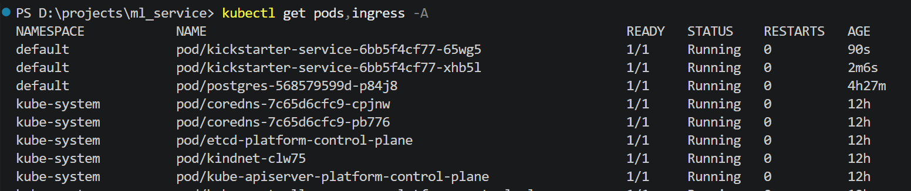

# Вопросы

1. Деплой в отличие от тестов и сборки требует доступ к как минимум к mlflow который развернут локально. Выхода в сеть нет - деплоить надо локально либо впн поднимать как то

2. 

- network kind дает доступ к сети докера в которой крутится кубер. без этого нельзя достучаться до апи кластера (kubectl ошибку кинет)

- сокет докера дает доступ к докеру самой машины вне контейнера раннера. без этого все команды с докером будут падать (build/load)

- group-add 0 добавляет пользователя в группу рута внутри контейнера раннера. без этого permission denied потому что сокет под рутом

3. kubectl create secret упадет если секрет уже есть, манифест обновит если уже есть и создаст если нет

4. Champion боевая модель, challenger для тестирования. Алиасы удобнее - перевесил метку в гуишке и радуйся, а если по версиям - надо в енвы лезть. Через алиас переход мгновенный, rollout undo требует пересоздания подов.

5. При первой загрузке модели под кинет ошибку и smoke не пройдет. в k9s можно глянуть статус (что то вроде CrashLoopBackOff), будут расти рестарты. В ci точно упадет smoke и можно глянуть логи на диагностике (статус пода)

6. Браузер - Ingress controller - Ingress resourse (правила) - mlflow service - mlflow pod

allowed-hosts и cors-allowed-origins защищают от CSRF и позволяют UI делать запросы к бэку mlflow

7. С locust и hpa вообще как то не пошло. Загрузка cpu было в серднем в районе 450%, тогда 2*450/60 = 15 реплик, ограничение в hpa.yaml 6 штук. Вниз уходили с задержкой в 5 минут, но сразу до минимума потому что трафик не естественный (сразу оборвался в 0)

8. в гите .dvc в хранилище сами данные. Как восстановить: git pull; uv run dvc pull. Конкретная версия: хэш датасета лежит в mlflow

# Для себя

docker pull apache/airflow:3.3.2

docker pull ghcr.io/mlflow/mlflow:v3.16.1

docker pull ghcr.io/actions/actions-runner:2.337.0

helm repo add prometheus-community https://prometheus-community.github.io/helm-charts

helm repo add traefik https://traefik.github.io/charts

helm repo update

kind create cluster --name platform --config platform/kind-config.yaml --image kindest/node:v1.31.2

kind load docker-image apache/airflow:3.3.2 ghcr.io/mlflow/mlflow:v3.16.1 --name platform

kubectl apply -f platform/mlflow.yaml

kubectl apply -f platform/airflow.yaml

helm upgrade --install monitoring prometheus-community/kube-prometheus-stack --version 91.5.2 -n monitoring --create-namespace -f platform/monitoring-values.yaml  --wait --timeout 15m

helm upgrade --install traefik traefik/traefik --version 41.6.0 -n traefik --create-namespace -f platform/traefik-values.yaml  --wait

kubectl apply -f platform/ingress.yaml

MLFLOW_TRACKING_URI=http://mlflow.localhost C=0.01 uv run python -m kickstarter.train

MSYS_NO_PATHCONV=1 docker run -d --name gh-runner \
  --network kind \
  --group-add 0 \
  --restart unless-stopped \
  -v /var/run/docker.sock:/var/run/docker.sock \
  -e REPO_URL="https://github.com/Teodorus730/ml_service" \
  -e RUNNER_TOKEN="" \
  ghcr.io/actions/actions-runner:2.337.0 \
  bash -c '[ ! -f .runner ] && ./config.sh --unattended --url "$REPO_URL" --token "$RUNNER_TOKEN" --name platform-kind --labels "kind"; exec ./run.sh'

kubectl rollout restart deploy/kickstarter-service
kubectl rollout status deploy/kickstarter-service
curl http://kickstarter.localhost/health

curl -X POST http://kickstarter.localhost/v1/predict -H "Content‐Type: application/json" -d @good.json

docker rm -f gh-runner

uv add --dev dvc
uv run dvc init
uv run dvc add data/ks-projects-201801.csv
uv run dvc remote add -d local ../dvc-storage
git add data/ks-projects-201801.csv.dvc data/.gitignore .dvc/config .dvcignore pyproject.toml uv.lock
git commit -m "data: датасет под DVC"
uv run dvc push

uv run dvc add data/ks-projects-201801-50k.csv
git add data/ks-projects-201801-50k.csv.dvc
git commit -m "data v2: 50k rows"
uv run dvc push
uv run dvc diff HEAD~1 

helm repo add metrics-server https://kubernetes-sigs.github.io/metrics-server/
helm upgrade --install metrics-server metrics-server/metrics-server --version 3.14.0 -n kube-system -f platform/metrics-server-values.yaml --wait
kubectl top nodes

uv run --with locust locust -f locustfile.py --headless -u 60 -r 20 -t 4m --host http://kickstarter.localhost

kubectl get hpa -w
 
kubectl describe hpa kickstarter-service